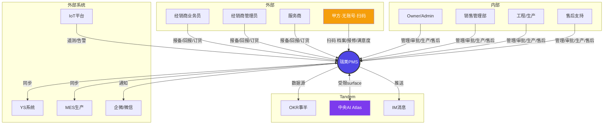
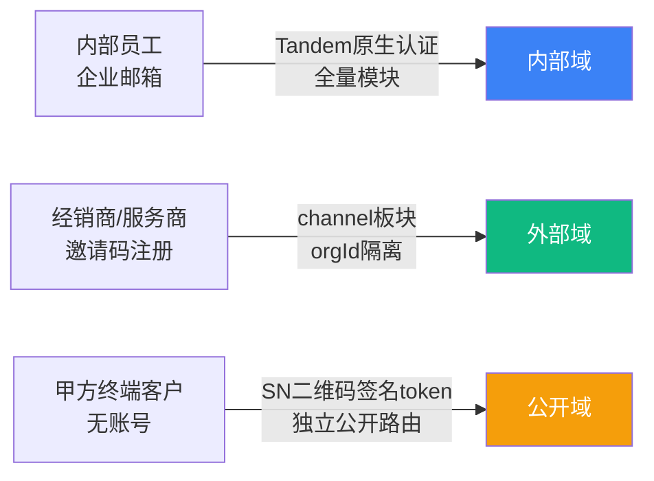
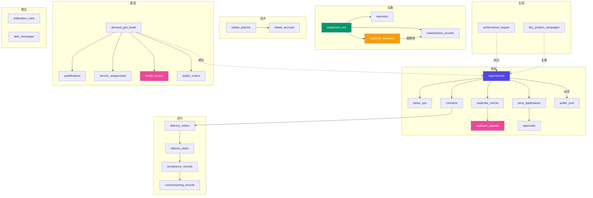
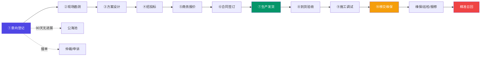
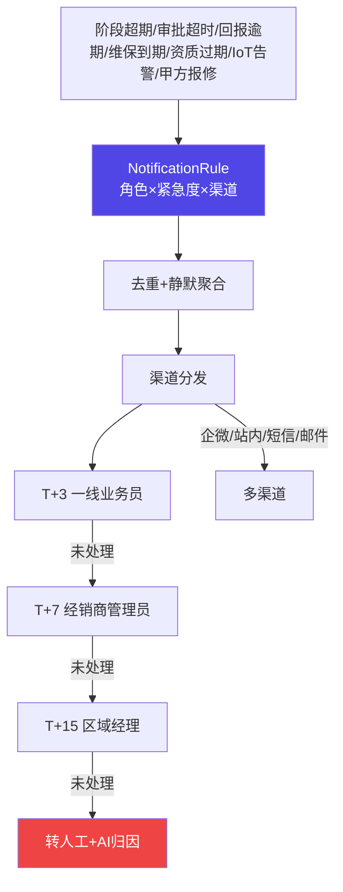
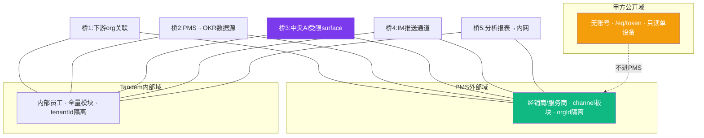
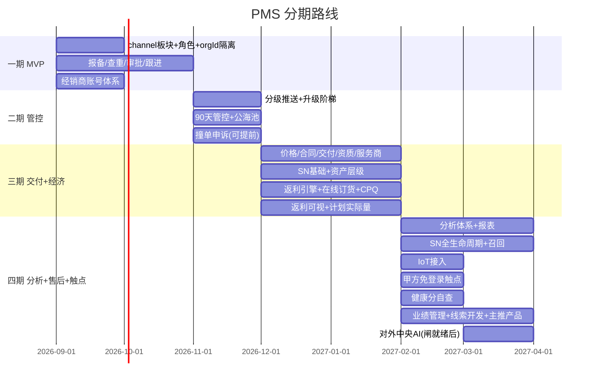
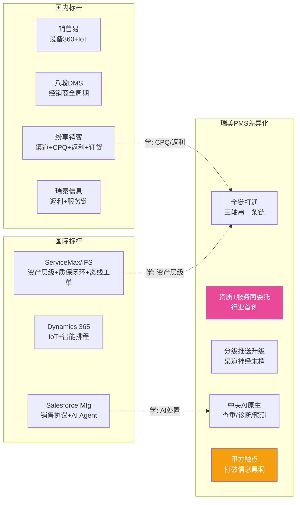
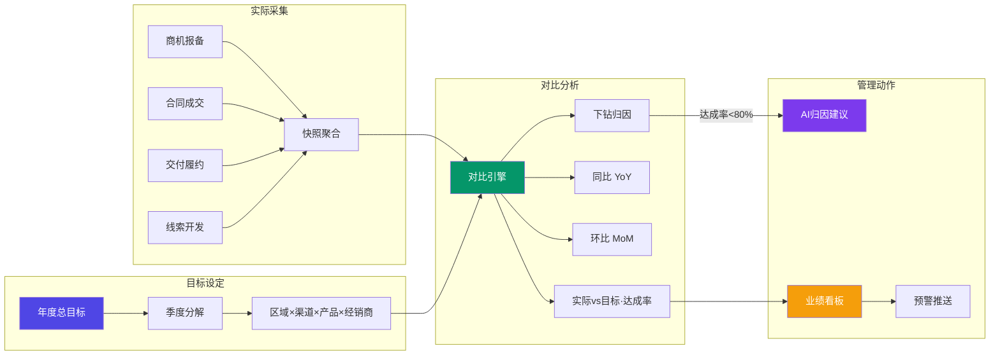

# 瑞美 PMS · 产品蓝图

> v2.9 · 对应 `CRM-PM-DESIGN.md` v2.9 · 商用/轻商设备 L2C + DMS + FSM

---

## 一、系统全景



---

## 二、三套安全模型



> 甲方走 `/api/public/*`，**不挂 `/api/pms/*`**，只读单设备 + 验证码写操作。

---

## 三、数据模型 (28 Collections)



---

## 四、L2C 十阶段流



> 经销商模式无回款阶段。每阶段时限管控 + 分级推送升级。

---

## 五、分级推送 + 升级阶梯



---

## 六、系统边界 — 三层切割 + 五桥



---

## 七、服务架构

```mermaid
graph TB
    subgraph 前端
        PG[页面: app/pms/* · app/eq/token · app/admin/pms/*]
        CP[组件: 看板/表单/时间线/健康分/扫码H5]
    end
    subgraph API层
        A1[/api/pms/* 经销商+内部<br/>channel板块守卫+orgId校验]
        A2[/api/public/* 甲方免登录<br/>token签名+验证码]
        A3[/api/admin/pms/* 内部管理]
    end
    subgraph Service层
        S1[opportunity-service]
        S2[duplicate-check + appeal]
        S3[stage-service + follow-up]
        S4[price + contract]
        S5[delivery + acceptance]
        S6[equipment-sn + recall + telemetry]
        S7[dealer-org + qualification + service-assign]
        S8[rebate + dealer-order + cpq]
        S9[customer-touchpoint]
        S10[dealer-health]
        S11[notification + escalation]
        S12[performance: target + comparison + dashboard + snapshot]
        S13[demand-gen + key-product]
    end
    subgraph AI层
        AI1[ai-duplicate-check]
        AI2[ai-delivery-risk]
        AI3[ai-maintenance-assistant]
        AI4[ai-production-forecast]
    end
    subgraph 存储
        KV[(KvStore 28 collections<br/>TandemStore)]
    end

    PG & CP --> A1 & A2 & A3
    A1 & A2 & A3 --> S1 & S2 & S3 & S4 & S5 & S6 & S7 & S8 & S9 & S10 & S11 & S12 & S13
    S1 & S2 & S3 --> AI1 & AI2 & AI3 & AI4
    S1 & S2 & S3 & S4 & S5 & S6 & S7 & S8 & S9 & S10 & S11 & S12 & S13 --> KV

    style A2 fill:#F59E0B,color:#fff
    style KV fill:#059669,color:#fff
    style AI1 fill:#7C3AED,color:#fff
```

---

## 八、四期分期



---

## 九、产品红线 — 经销商价值配对

```mermaid
graph LR
    subgraph 管控动作
        C1[报备查重] → V1[防撞单·保护先报者]
        C2[阶段时限] → V2[超期预警·不被遗忘]
        C3[资质门槛] → V3[委托解药·不挡生意]
        C4[回报合规] → V4[换保护期·延期申请]
        C5[考核排名] → V5[健康分自查·无埋雷]
        C6[返利规则] → V6[进度可视·信任增强]
    end

    style V1 fill:#10B981,color:#fff
    style V5 fill:#EC4899,color:#fff
    style V6 fill:#EC4899,color:#fff
```

> **红线**: 每个管控动作必须配一个经销商可感知的价值，否则一线敷衍→数据失真→系统空壳。

---

## 十、甲方触点 — 打破信息黑洞

```mermaid
graph LR
    SN[设备SN二维码] -->|扫码| H5[/eq/token 只读H5]
    H5 --> F1[设备档案 型号/安装日]
    H5 --> F2[质保状态 保到何时]
    H5 --> F3[说明书/保养]
    H5 --> F4[报修入口]
    H5 --> F5[满意度回评]
    F4 -->|验证码| MR[自动转维保工单]
    F5 -->|直回瑞美| KV[(满意度真值)]
    KV -->|防粉饰| DH[经销商考核]
    RC[重大召回] -->|直达甲方| SMS[短信/扫码提示]

    style H5 fill:#F59E0B,color:#fff
    style KV fill:#059669,color:#fff
    style RC fill:#EF4444,color:#fff
```

> 满意度**直回瑞美不经经销商**，作考核真值来源。召回直达甲方满足合规知情权。

---

## 十一、竞品功能对标 (纯功能口径)



---

## 十二、风险全景

| 层 | 风险 | 状态 |
|---|---|---|
| **技术 P0** | F1 板块裸奔 / F2 唯一性 / F3 性能 / F4 AI越权 | ⚠️ 编码期必须闭合 |
| **产品 P1** | F11 经销商获得感弱→数据失真 | ✅ 设计已落地红线; ⚠️ 移动端极简待编码 |
| **合规 P1** | F14 召回知情权 / F13 满意度粉饰 | ✅ 设计已落地甲方触点 |
| **采纳** | 经销商不愿用 / 甲方不扫码 | 📊 上线后盯两个北极星: 录入率+扫码量 |
```

---

## 十三、业绩管理系统 — 管理闭环



> **三层数据**: 目标 (PerformanceTarget) → 实际 (快照从商机/合同/交付聚合) → 对比 (达成率+同比+环比+归因)
>
> **与§6.7分析体系的区别**: 分析体系 = 描述性 (发生了什么, 实时查询); 业绩管理 = 管控性 (目标达成了没有, 差多少, 为什么, 预聚合快照)
>
> **线索开发 (DemandGenLead)**: 报备前的早期信号 (展会/推荐/外呼/数字营销) → 跟进 → 合格 → 转化为商机报备。线索漏斗转化率 = 线索开发管理核心指标。
>
> **主推产品 (KeyProductCampaign)**: 管理层指定重点型号, 配套价格激励+返利加码+重点区域+重点经销商, 跟踪推广达成率。
