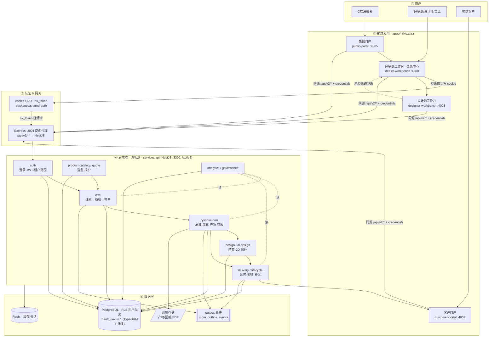
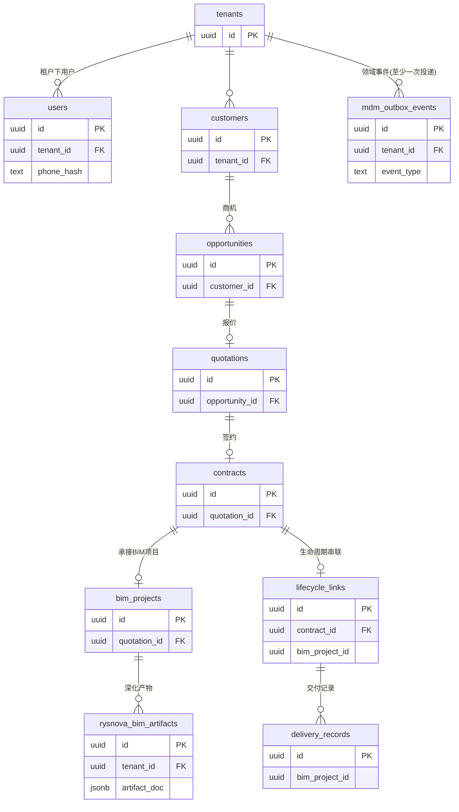

# 瑞合数智枢纽 · 一页纸层级蓝图

> 2026-07-06 · 数据库收敛后。用户 → 应用 → 认证/代理 → 后端领域（功能）→ PostgreSQL（数据关系），一图看全。
> 详版见 `docs/ARCHITECTURE-BLUEPRINT.md`。

## 核心业务流（一句话）

`线索(crm) → 签单(crm) → 承接/深化(rysnova-bim) ↔ 精算放行(design) → 交付/验收(delivery·lifecycle) → 客户看进度(customer-portal)`，每次写库在同一 RLS 事务内写 `outbox` 事件驱动跨域。

## 数据库关系（PostgreSQL · schema `rhautt_nexus`）

> 聚合只读视图 `v_bim_project_delivery` = `bim_projects` ⋈ `lifecycle_links` ⋈ `delivery_records` ⋈ `contracts`，供 rysnova-bim 一屏查交付全景。

## 三条铁律

| # | 规则 |
|---|---|
| 1 | 后端**唯一真相源 = NestJS(:3300)/PostgreSQL**；`/api/v2/**` 全量走它。MongoDB 已从真相源下线（仅遗留 Express legacy 自用）。 |
| 2 | 前端**同源相对 `/api/v2/*` + `credentials:'include'`**；认证靠共享 cookie `nx_token`，禁止硬编码端口。 |
| 3 | 所有租户数据经 **Postgres RLS + `withRlsTransaction`** 隔离；写业务与写 `outbox` 事件同事务原子。 |
